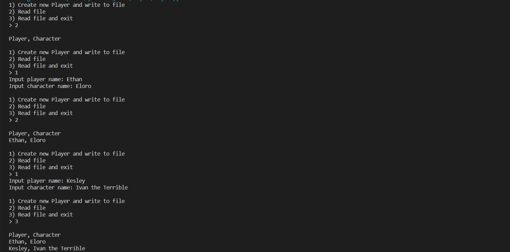

# Description  
This program creates a file containing a list of players and their character names. If the user opts to add a new player, it asks them for both the player's name as well as the character's name. Once the user decides to end the program, it reads the file to them which includes the list players made, and then the program closes.

# Setup and Execution
This program was created on Visual Studio Code in the Python Language. Ensure that the Python extension is added by checking the extension tab at the middle of the screen. Once set up, it makes use of a Player class to save the created info for the player. Though short lived, the class stores the info long enough for it to be written to a file, and then deleted to make way for the next player that is put in.

# Example

# Useful Websites
[w3schools](https://www.w3schools.com/python/default.asp) - contains tutorials for Python, including writing to and reading from a file.